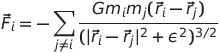
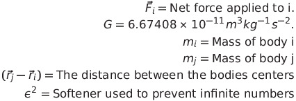

# N-Body-Simulation
 A simulation for gravitational attraction for N bodies in up to R3 space.
 
 ### Details
 An N-Body simulation is used to simulate an dynamic system of N number of bodies that have a physical interaction with each other, in this case gravity. The complexity of the current algorithm is .
 
 The program will generate N number of bodies and loop for a set number of steps. Each step the list of bodies will be iterated through, and the net force applied to the acceleration of the body, using the following equation:
 

This acceleration will be applied to the existing velocity of the body. Once the list of bodies has been processed, another iteration will be done. This second iteration will use the new velocity to update the position in space.

### Thank you:
[josh314151](https://github.com/josh314151) - For helping me find equation errors when all hope was lost.

## Installation
From the CLI, execute:
1. `git clone https://github.com/ScientificGoose/N-Body-Simulation.git`
2. `cd N-Body-Simulation`
3. `python3 -m venv venv`
4. `source venv/bin/activate`
5. `pip install -r requirements.txt`

## Testing
From the CLI, execute:
* `pytest tests/` _to run all tests_
* `pytest tests/<test_file.py>` _to run a suite of tests_
* `pytest tests/<test_file.py>::<test_name>` _to run a single test_
